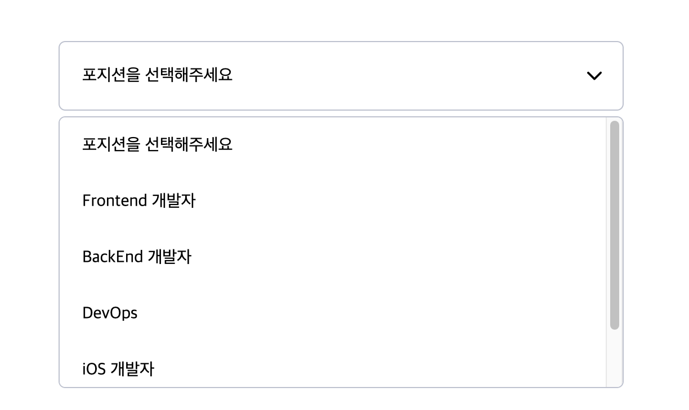

DropDownSelect 컴포넌트는 Select Option을 쉽게 구현할 수 있도록 해줍니다.



## Props

| 속성 종류                 | 속성 타입                       | 속성 값 | 옵셔널 여부 |
| ------------------------- | ------------------------------- | ------- | ----------- |
| width                     | string                          |         | X           |
| height                    | string                          |         | X           |
| itemList                  | string[]                        |         | X           |
| itemListMaxHeight         | string                          |         | O           |
| itemListCustomStyle       | CSSObject                       |         | O           |
| itemHeight                | string                          |         | O           |
| selectItem                | string                          |         | X           |
| setSelectItem             | Dispatch SetStateAction string  |         | X           |
| isShowingItemList         | boolean                         |         | X           |
| setIsShowingItemList      | Dispatch SetStateAction boolean |         | X           |
| dropDownSelectCustomStyle | CSSObject                       |         | O           |

## Example

```typescript
import { DropDownSelect } from "@stubee2/stubee2-rolling-ui";

function App() {
  const [selectItem, setSelectItem] = useState("init");
  const [isShowingItemList, setIsShowingItemList] = useState(false);
  const list = [
    "포지션을 선택해주세요",
    "Frontend 개발자",
    "BackEnd 개발자",
    "DevOps",
    "iOS 개발자",
    "Android 개발자",
  ];

  return (
    <DropDownSelect
      width="300px"
      height="60px"
      selectItem={selectItem}
      setSelectItem={setSelectItem}
      itemList={list}
      isShowingItemList={isShowingItemList}
      setIsShowingItemList={setIsShowingItemList}
    />
  );
}

export default App;
```
