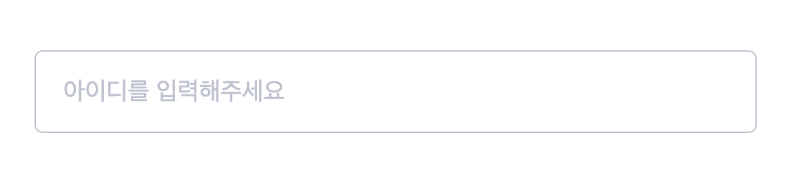

TextInput 컴포넌트는 TextInput 쉽게 구현할 수 있도록 해줍니다.



## Props

| 속성 종류    | 속성 타입            | 속성 값                                                                   | 옵셔널 여부 |
| ------------ | -------------------- | ------------------------------------------------------------------------- | ----------- |
| value        | string               |                                                                           | x           |
| type         | string               |                                                                           | O           |
| textType     | type                 | input ,textarea                                                           | O           |
| placeholder  | string               |                                                                           | O           |
| customStyle  | CSSObject            |                                                                           | O           |
| name         | string               |                                                                           | O           |
| autoComplete | type                 | on ,off                                                                   | O           |
| disabled     | boolean              | false                                                                     | O           |
| isError      | boolean              | false                                                                     | O           |
| errorMessage | string               |                                                                           | O           |
| handleChange | mouse event function | (e: React.ChangeEvent `HTMLInputElement` or `HTMLTextAreaElement`)=> void | O           |

## Example

```typescript
import { TextInput } from "@stubee2/stubee2-rolling-ui";

function App() {
  return (
    <TextInput
      autoComplete="off"
      value={value}
      customStyle={S.InputStyle}
      placeholder={"기업명을 입력해 주세요"}
      handleChange={handleChange}
      name="name"
    />
  );
}

export default App;
```
